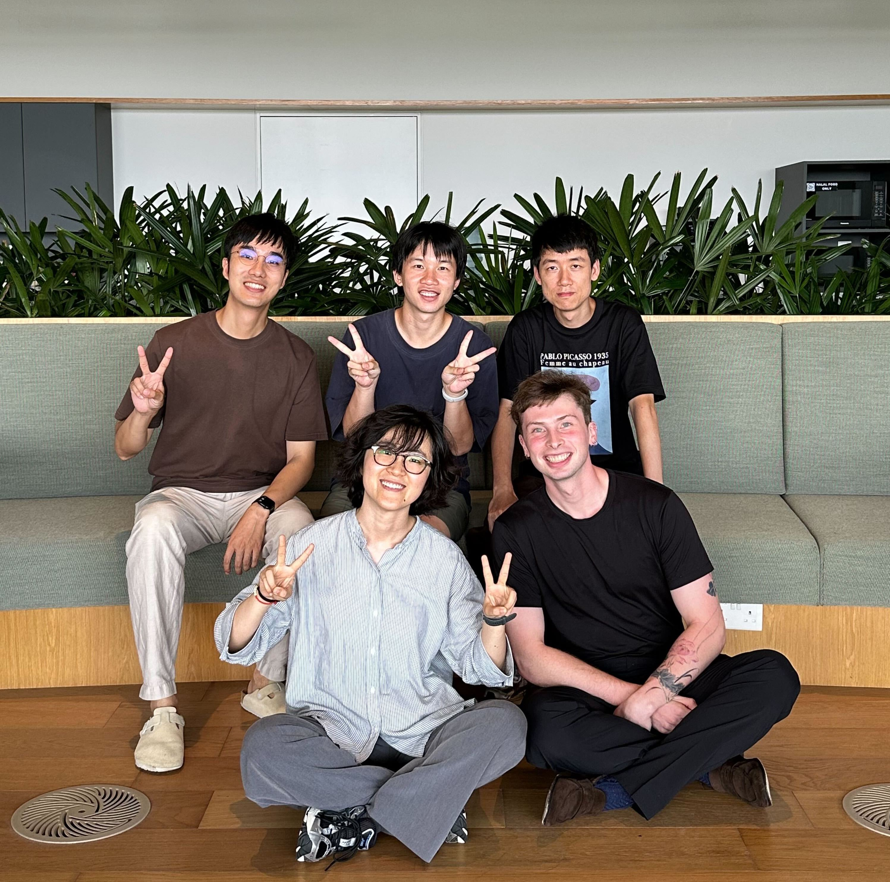

As part of our *AI-Driven Climate Resilient Cooling: Robust Reinforcement Learning for Mixed-Mode Ventilation* project, we recently carried out a two-week experimental campaign with our collaborators from The University of Tokyo, hosted by Kajima Technical Research Institute Singapore (KaTRIS) at their THE GEAR building.

<!--more-->

The goal was to fully characterise a mixed-mode ventilation (MMV) space in Singapore — capturing detailed measurements of environmental conditions, system operation, and occupancy patterns. This dataset will help us determine the **key data requirements for developing a high-fidelity digital twin of an MMV system** and for designing **robust reinforcement learning (RL) control strategies** that can adapt to dynamic real-world conditions.

Beyond the experiments, the visit also provided opportunities for in-depth discussions on experimental design, data integration, and data informativeness.

We’re super excited about the dataset we’ve collected. Stay tuned as we begin analysis and share insights in the coming months.

