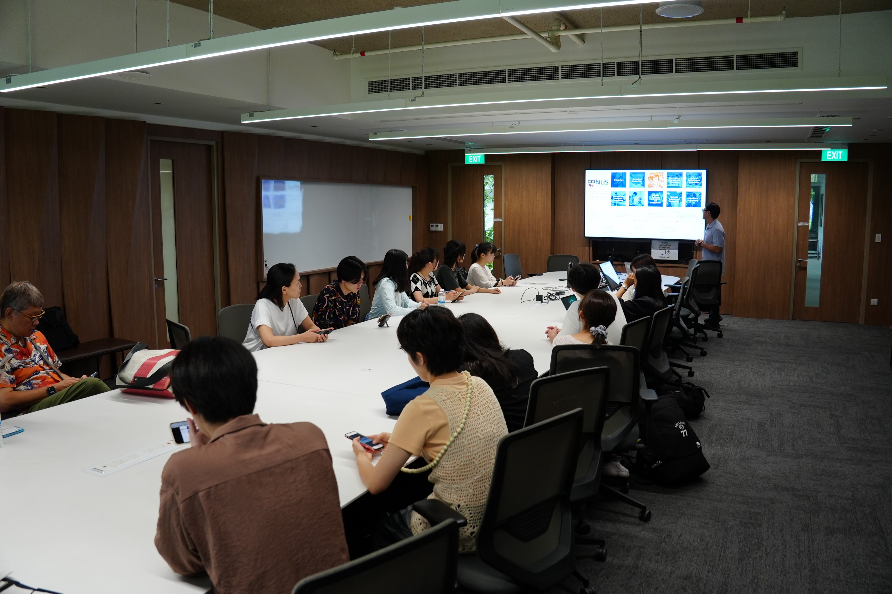
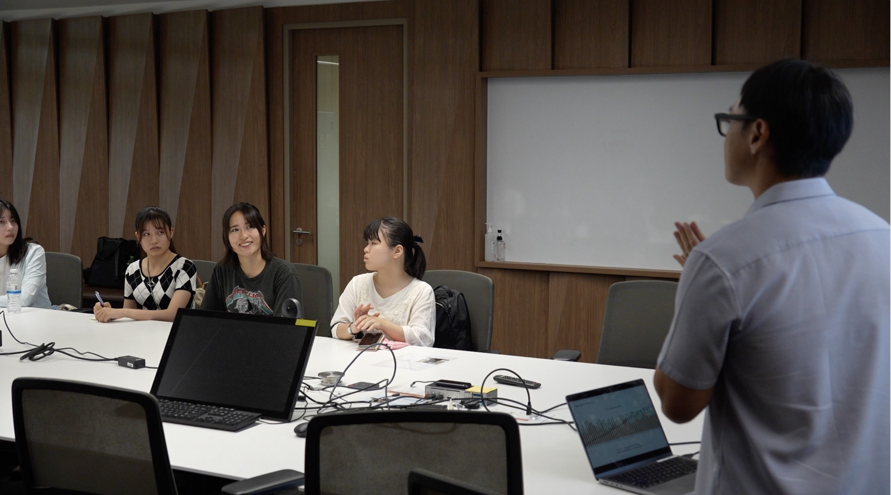
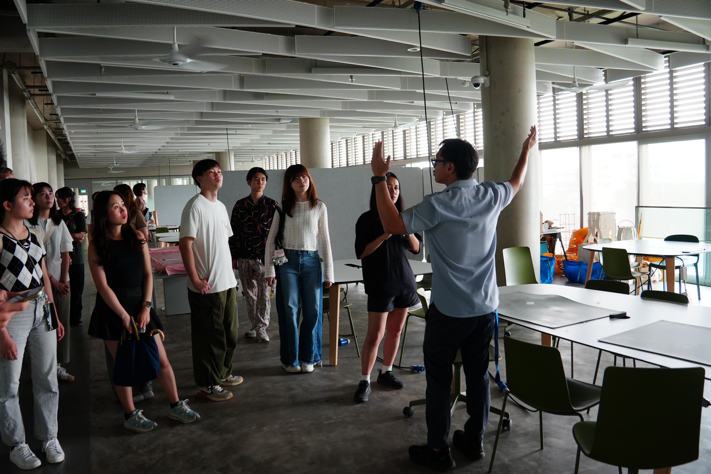

We were delighted to host students and faculty from the **Good Life on Earth Program** at the **University of Tokyo** ([link](https://www.one-earth-g.a.u-tokyo.ac.jp/gle/en/)) during their visit to NUS!  

<!--more-->

**Good Life on Earth** is an initiative aimed at nurturing the innovative ideas of high school and university students—ideas that hold significance for the future of our planet. The program encourages students to pursue their passions and provides comprehensive support to realize their concepts, including mentorship by leading researchers and access to human and financial resources.  

It was a truly meaningful visit with **undergraduate and high school students from various schools and universities**. The group toured the **SDE4 Net-Zero Energy Building**, where we shared the building’s **passive design and active system features** that enable its net-zero energy performance in Singapore’s tropical climate. The session also included a discussion on our ongoing research in **effective mixed-mode ventilation (MMV)** in the tropics.

It was wonderful to see such enthusiasm and curiosity from all the students!

